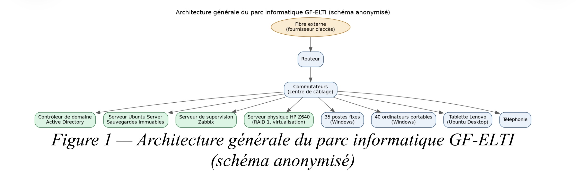
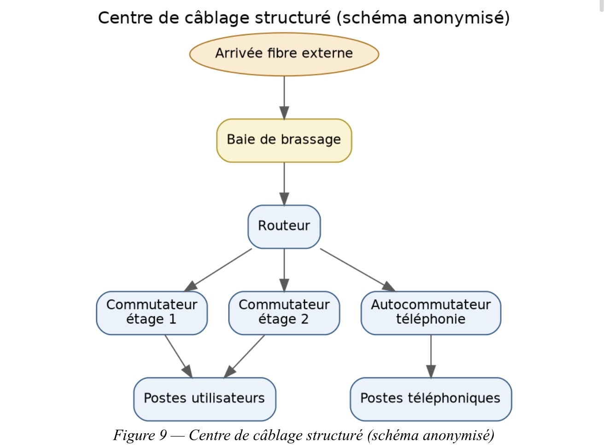

# 🏢 Stage — GF-ELTI

## 📌 Présentation

Durant mon stage au sein de **GF-ELTI**, entreprise italienne basée à Bergame, j’ai participé à plusieurs interventions liées à l’administration des systèmes et des infrastructures informatiques.

L’environnement informatique comprenait notamment un parc d’environ **100 postes Windows**, une tablette Lenovo sous Ubuntu Desktop, un serveur physique HP Z640, un environnement virtualisé VMware, un domaine Active Directory ainsi qu’une infrastructure réseau documentée.

> 🔒 Certaines informations, captures d’écran et photographies ne sont pas présentées afin de respecter les règles de confidentialité de l’entreprise.

---

## 🎯 Objectifs

Les principales missions qui m’ont été confiées étaient :

* Déployer et préparer les nouveaux postes informatiques.
* Intégrer les postes au domaine Active Directory.
* Faciliter l’assistance à distance des utilisateurs.
* Valoriser du matériel existant grâce à Linux.
* Participer à l’administration et à l’évolution de l’infrastructure.
* Renforcer la protection des données grâce aux sauvegardes.
* Documenter l’infrastructure réseau existante.

---

## 🖥️ 1. Déploiement des postes Windows

J’ai participé au déploiement et à la configuration de **75 postes Windows**.

Les principales étapes étaient :

* préparation des postes ;
* renommage des machines ;
* intégration au domaine Active Directory ;
* configuration des comptes et des droits ;
* installation des logiciels nécessaires ;
* vérification du fonctionnement des postes.

Cette mission m’a permis de mettre en pratique mes connaissances en **administration Windows et Active Directory**.

---

## 🌐 2. Documentation de l’infrastructure réseau

J’ai également participé à la documentation du centre informatique afin d'identifier et de mieux comprendre les différents équipements et connexions.

La documentation concernait notamment :

* switches ;
* routeurs ;
* téléphonie ;
* arrivée fibre ;
* stockage SAN ;
* disques SATA/SAS ;
* câblage réseau.

Cette activité m’a permis de mieux comprendre l’organisation physique d’une infrastructure informatique et l’importance d’une documentation claire pour faciliter les interventions.

---

## 🖥️ 3. Support à distance avec AnyDesk

Afin de faciliter les interventions sur les postes situés sur d’autres sites, j’ai participé à la mise en place et à l’utilisation d’**AnyDesk**.

Cette solution permettait aux techniciens d'accéder à distance aux postes des utilisateurs afin de réaliser des opérations de support et de dépannage.

---

## 🐧 4. Installation d’Ubuntu Desktop

J’ai installé **Ubuntu Desktop sur une tablette Lenovo** afin de réutiliser un équipement existant avec un système d’exploitation libre.

Pour réaliser cette installation :

1. téléchargement de l’image ISO Ubuntu ;
2. création d’une clé USB bootable avec Rufus ;
3. démarrage de la tablette sur la clé USB ;
4. installation d’Ubuntu Desktop ;
5. configuration et vérification du fonctionnement du système.

Cette mission m’a permis de développer ma pratique de l’administration d’un environnement **Linux**.

---

## 🖥️ 5. Serveur physique HP Z640

J’ai participé à la mise en place d’un **serveur physique HP Z640** destiné à l’infrastructure de l’entreprise.

L’objectif était notamment de mettre en place une solution de stockage tolérante aux pannes avec **RAID 1**.

La configuration a nécessité plusieurs tests liés au démarrage du serveur, au mode UEFI/Legacy et à la configuration du stockage.

Cette intervention m’a permis de travailler sur des problématiques liées à l'installation d’un serveur physique et à la **tolérance aux pannes**.

---

## 🔐 6. Serveur de sauvegardes immuables

J’ai participé à la mise en place d’un **serveur Ubuntu dédié aux sauvegardes immuables**.

L’objectif était de disposer d’une copie des données protégée contre les modifications ou suppressions, notamment dans le contexte du risque de **ransomware**.

Une durée de rétention de **deux semaines** a été retenue pour les sauvegardes.

Cette mission m’a permis de mieux comprendre l’importance des stratégies de sauvegarde et de protection des données dans une infrastructure informatique.

---

## 🧰 Technologies utilisées

| Domaine        | Technologies                         |
| -------------- | ------------------------------------ |
| Systèmes       | Windows, Windows Server, Ubuntu      |
| Annuaire       | Active Directory                     |
| Virtualisation | VMware                               |
| Réseau         | TCP/IP, switches, routeurs, fibre    |
| Support        | AnyDesk                              |
| Serveur        | HP Z640                              |
| Stockage       | RAID 1, SAN, SATA/SAS                |
| Sauvegarde     | Ubuntu Server, sauvegardes immuables |
| Déploiement    | Rufus                                |

---

## 📚 Compétences développées

Ce stage m’a permis de développer mes compétences en :

* administration systèmes ;
* déploiement de postes ;
* Active Directory ;
* environnement Linux ;
* virtualisation ;
* infrastructure réseau ;
* serveurs physiques ;
* stockage et RAID ;
* sauvegardes ;
* support informatique ;
* documentation technique.

---

## 🔒 Confidentialité

Les informations présentées dans ce projet ont été **anonymisées et adaptées** afin de respecter la confidentialité de GF-ELTI. Aucun élément permettant d’identifier précisément l’infrastructure interne de l’entreprise n’est publié.
